# Seat Booking System

A monorepo of five independently deployable services for a seat booking platform with payment processing, backed by PostgreSQL, MongoDB, and SQS FIFO.

## Architecture

```
seat-booking/
├── apps/
│   ├── web/                        # React 18 + Vite (SPA) — port 3000
│   ├── api-gateway/                # NestJS — routing + Clerk auth — port 3001
│   ├── order-service/              # NestJS — seat reservation — port 3002
│   ├── payment-service/            # NestJS — queue consumer + webhook — port 3003
│   └── mock-payment-gateway/       # NestJS — simulate payment + fire webhook — port 3004
│
├── packages/
│   ├── shared-types/               # Shared interfaces & enums
│   ├── shared-errors/              # AppError base classes
│   └── database/                   # TypeORM (PostgreSQL + MongoDB audit)
│
├── migrations/
│   └── 001_init.sql                # PostgreSQL schema + seed data
│
├── docker-compose.yml
└── README.md
```

### Overall Architecture



### Order & Payment Queue Flow



## Services

| Service | Port | Purpose |
|---|---|---|
| **web** | 3000 | React SPA for seat selection, auth via Clerk, order creation |
| **api-gateway** | 3001 | Entry point, Clerk auth guard, proxy to downstream services |
| **order-service** | 3002 | Seat reservations, order creation, SQS event publishing |
| **payment-service** | 3003 | Consume SQS, orchestrate payments, handle webhooks |
| **mock-payment-gateway** | 3004 | Simulate async payment provider for testing |

## Quick Start

### 1. Install dependencies

```bash
npm install
```

### 2. Start infrastructure

```bash
docker compose up -d
```

This starts:
- **PostgreSQL** (`:5432`) — transactional data (seats, orders, webhook_logs, payments)
- **MongoDB** (`:27017`) — append-only audit trails
- **LocalStack SQS** (`:4566`) — FIFO message queue
- **Sentry** (`:9000`) — error tracking
- **Redis** (`:6379`) — Sentry dependency

### 3. Run SQL migrations

```bash
# Apply schema and seed data to PostgreSQL
docker compose exec -T postgres psql -U postgres -d seat_booking < migrations/001_init.sql
```

### 4. Set up Sentry

```bash
npm run setup:sentry
```

Creates the admin user, organization, project, and writes a valid `SENTRY_DSN` into each service's `.env` file.

### 5. Create SQS queue

```bash
npm run setup:queue
```

Creates the `payment-queue.fifo` queue in LocalStack (FIFO, content-based deduplication disabled).

### 6. Run all services

```bash
# All services in one terminal
npm run start:watch:all

# Or run individual services
cd apps/api-gateway && npm run start:dev
cd apps/order-service && npm run start:dev
cd apps/payment-service && npm run start:dev
cd apps/mock-payment-gateway && npm run start:dev
cd apps/web && npm run dev
```

### 7. Seed seats (optional)

```bash
node create-seats.js
```

Creates 3 sample seats (A1, A2, B1) via the order service API.

## Run Tests

```bash
# Run all tests
npm test

# Run lint
npm run lint

# Run build
npm run build
```

## Key Features

- **Double booking prevention:** SERIALIZABLE isolation + SELECT FOR UPDATE
- **Ordered payment processing:** SQS FIFO partitioned by accountId
- **Idempotency:** webhook_logs table + SQS deduplication
- **Audit trail:** MongoDB with TTL indexes (5yr orders, 7yr payments)
- **Auth:** Clerk with 90-day session expiry

## Payment Flow

1. User selects seat → `POST /orders` (seat reserved as PENDING)
2. Order service publishes to SQS FIFO
3. Payment service consumes message → calls mock gateway
4. Mock gateway fires webhook after 1s delay
5. Webhook handler checks idempotency → updates order + seat atomically

## Infrastructure Ports

| Component | Port |
|---|---|
| web | 3000 |
| api-gateway | 3001 |
| order-service | 3002 |
| payment-service | 3003 |
| mock-payment-gateway | 3004 |
| PostgreSQL | 5432 |
| MongoDB | 27017 |
| LocalStack SQS | 4566 |
| Redis | 6379 |
| Sentry | 9000 |
